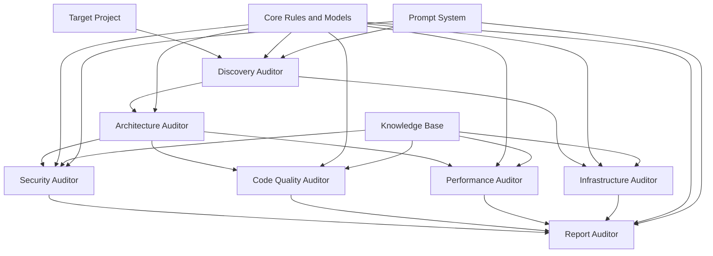
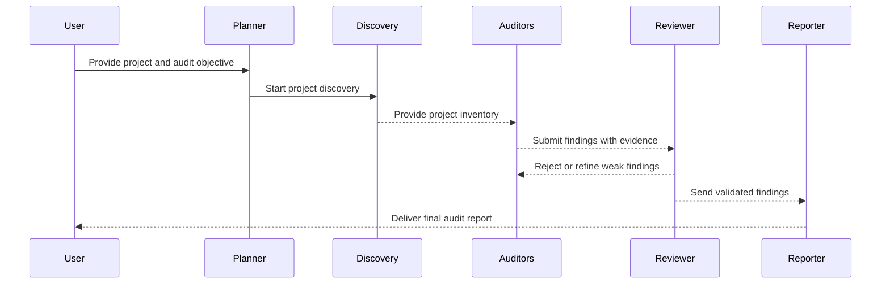

<a id="readme-top"></a>

<div align="center">

# AI Audit Framework

**A standardized framework for AI-powered software auditing.**

[](#roadmap)
[](docs/METHODOLOGY.md)
[](auditors/)
[](knowledge-base/)
[](LICENSE)

Maintained by [Talisson Souza](https://www.talissonsouza.com.br) | [Discord Community](https://discord.talissonsouza.com.br)

</div>

<!-- Banner placeholder: replace this table with an image file after a banner is added to the repository. -->
<table>
  <tr>
    <td width="100%">
      <strong>AI Audit Framework (AAF)</strong><br />
      Modular auditors, evidence-first analysis, standardized schemas, reusable knowledge, prompt orchestration, and professional audit reporting.
    </td>
  </tr>
</table>

## Contents

- [Overview](#overview)
- [Why AAF Exists](#why-aaf-exists)
- [Core Philosophy](#core-philosophy)
- [Repository Status](#repository-status)
- [Key Features](#key-features)
- [Architecture Overview](#architecture-overview)
- [Audit Workflow](#audit-workflow)
- [Supported Auditors](#supported-auditors)
- [Knowledge Base](#knowledge-base)
- [Prompt System](#prompt-system)
- [Schemas and Specifications](#schemas-and-specifications)
- [AI Compatibility](#ai-compatibility)
- [Project Structure](#project-structure)
- [Quick Start](#quick-start)
- [Installation](#installation)
- [Documentation Links](#documentation-links)
- [Community](#community)
- [Roadmap](#roadmap)
- [FAQ](#faq)
- [Contributing](#contributing)
- [License](#license)

## Overview

The AI Audit Framework (AAF) is an open-source framework for standardizing software audits performed with Artificial Intelligence.

Instead of relying on one large prompt, AAF divides an audit into specialized auditors. Each auditor focuses on one engineering domain, produces structured output, and hands that output to the next stage. The final report is assembled from project discovery, architecture observations, code-quality findings, security risks, performance analysis, infrastructure review, and report consolidation.

AAF is designed for teams that want AI-assisted audits to be:

- consistent across projects;
- evidence-based instead of speculative;
- modular enough to evolve by domain;
- understandable by engineers and stakeholders;
- reusable across different technologies and AI models.

> [!IMPORTANT]
> AAF is a documentation and prompt framework in this repository. It defines auditors, methodology, schemas, prompts, specifications, and a knowledge base. It does not currently include a CLI, API server, dashboard, package manifest, executable audit engine, or automated validation runtime.

## Why AAF Exists

AI can inspect code quickly, but unstructured AI audits often fail in predictable ways:

| Problem | AAF response |
| --- | --- |
| One prompt tries to discover, analyze, score, and report everything | Separate auditors perform scoped stages |
| Findings appear without evidence | Core rules require evidence for every finding |
| Different audits use different terminology | Shared severity, confidence, scoring, schema, and reporting documents |
| Security and quality recommendations get mixed together | Each auditor owns one engineering domain |
| Reports are difficult to review | The Report Auditor consolidates findings with standardized sections |
| AI output depends too heavily on provider behavior | Prompts and schemas define expected behavior independently of the model |

AAF turns AI auditing into a repeatable engineering workflow rather than a free-form conversation.

## Core Philosophy

| Principle | Meaning in AAF |
| --- | --- |
| Modular architecture | Auditors are independent modules with explicit inputs, responsibilities, outputs, and limitations. |
| Explainability | Findings must include description, evidence, impact, recommendation, severity, confidence, and references. |
| Evidence first | Missing context must be stated as a limitation instead of being invented. |
| Reproducibility | Auditors follow the same methodology and output schemas on every audit. |
| Standardization | Core documents define audit flow, evidence rules, severity, confidence, scoring, and report structure. |
| Extensibility | New auditors, knowledge entries, schemas, and prompts can be added without rewriting existing modules. |
| Model independence | AAF can be used with any AI model capable of following the framework prompts and output requirements. |

<details>
<summary><strong>What AAF is not</strong></summary>

AAF is not a vulnerability scanner, not a static analyzer, not a package that runs audits automatically, not a hosted service, and not a replacement for human review.

This repository is the framework foundation: a structured documentation system, prompt system, auditor catalog, knowledge base, schemas, and specifications for performing AI-assisted audits consistently.

</details>

## Repository Status

This ZIP contains the documentation framework and auditor materials for AAF V1.

| Capability | Status in this ZIP | Source |
| --- | --- | --- |
| Core audit rules | Available | [core/rules.md](core/rules.md) |
| Audit flow | Available | [core/audit-flow.md](core/audit-flow.md), [core/workflow.md](core/workflow.md) |
| Severity model | Available | [core/severity.md](core/severity.md) |
| Confidence model | Available | [core/confidence.md](core/confidence.md) |
| Scoring model | Available | [core/scoring.md](core/scoring.md) |
| Discovery Auditor | Available | [auditors/discovery/README.md](auditors/discovery/README.md) |
| Architecture Auditor | Available | [auditors/architecture/README.md](auditors/architecture/README.md) |
| Security Auditor | Available | [auditors/security/README.md](auditors/security/README.md) |
| Code Quality Auditor | Available | [auditors/code-quality/README.md](auditors/code-quality/README.md) |
| Performance Auditor | Available | [auditors/performance/README.md](auditors/performance/README.md) |
| Infrastructure Auditor | Available | [auditors/infrastructure/README.md](auditors/infrastructure/README.md) |
| Report Auditor | Available | [auditors/report/README.md](auditors/report/README.md) |
| Prompt system | Available | [prompts/](prompts/) |
| Knowledge base | Available | [knowledge-base/](knowledge-base/) |
| Schemas | Available as Markdown/YAML structures | [schemas/](schemas/) |
| Specifications | Available | [specifications/](specifications/) |
| CLI, API, dashboard, AST parser, rule engine, agents, RAG, PDF, HTML reports | Planned | [Roadmap](#roadmap) |

> [!WARNING]
> Do not expect directories such as `cli/`, `api/`, `dashboard/`, `contracts/`, `templates/`, `governance/`, `assets/`, or `models/` in this ZIP. They are not part of the current package.

## Key Features

### Domain-specific auditors

AAF separates the audit into seven auditor directories:

- [Discovery](auditors/discovery/README.md)
- [Architecture](auditors/architecture/README.md)
- [Security](auditors/security/README.md)
- [Code Quality](auditors/code-quality/README.md)
- [Performance](auditors/performance/README.md)
- [Infrastructure](auditors/infrastructure/README.md)
- [Report](auditors/report/README.md)

### Evidence-based finding rules

Core audit rules require auditors to:

- never assume missing information;
- include evidence in every finding;
- justify every recommendation;
- separate facts from assumptions;
- state limitations when context is insufficient.

See [core/rules.md](core/rules.md) and [core/evidence.md](core/evidence.md).

### Standard output models

AAF includes Markdown schema documents for:

- [Project Schema](schemas/project-schema.md)
- [Finding Schema](schemas/finding-schema.md)
- [Report Schema](schemas/report-schema.md)

These schemas define the expected structure of project inventories, findings, and final reports.

### Reusable knowledge base

The [knowledge-base/](knowledge-base/) directory contains reusable references for security, languages, frameworks, databases, cloud providers, and architecture styles.

### Prompt orchestration

The [prompts/](prompts/) directory defines separate roles for system rules, planning, discovery, security review, critique, review, and reporting.

### Professional report consolidation

The [Report Auditor](auditors/report/README.md) consolidates all auditor outputs into an executive and technical report with findings, severity analysis, confidence analysis, recommendations, scoring, and roadmap.

## Architecture Overview

AAF uses a staged modular architecture. Each stage consumes the output of earlier stages and contributes its own structured analysis.



The official architecture document is [docs/ARCHITECTURE.md](docs/ARCHITECTURE.md).

### Architectural responsibilities

| Component | Responsibility |
| --- | --- |
| `core/` | Defines global rules, audit flow, evidence rules, severity, confidence, scoring, output behavior, and reporting principles. |
| `auditors/` | Contains the domain-specific auditors and their prompts, specifications, checklists, examples, modules, and tests. |
| `knowledge-base/` | Stores reusable engineering references that auditors can consult during analysis. |
| `prompts/` | Defines the prompt pipeline and model behavior constraints. |
| `schemas/` | Defines Markdown/YAML output structures for project inventory, findings, and reports. |
| `specifications/` | Defines reusable specifications for modules, findings, and reports. |
| `docs/` | Explains architecture and methodology at framework level. |

## Audit Workflow

AAF follows the lifecycle described in [core/audit-flow.md](core/audit-flow.md) and [docs/METHODOLOGY.md](docs/METHODOLOGY.md).



The standard execution order is:

1. Project Discovery
2. Architecture Analysis
3. Technology Detection
4. Security Audit
5. Code Quality Audit
6. Performance Audit
7. Infrastructure Audit
8. Finding Aggregation
9. Risk Assessment
10. Score Calculation
11. Report Generation

> [!NOTE]
> The workflow is currently documented as methodology and prompt guidance. The ZIP does not include an executable orchestrator.

## Supported Auditors

### Auditor matrix

| Auditor | Folder | Purpose | Main outputs |
| --- | --- | --- | --- |
| Discovery | [auditors/discovery/](auditors/discovery/) | Understands the project before technical analysis begins. | Project inventory, technology stack, structure, dependencies, environment signals. |
| Architecture | [auditors/architecture/](auditors/architecture/) | Evaluates structural design, module boundaries, coupling, cohesion, and scalability. | Architecture findings, structural observations, recommendations, architecture score. |
| Security | [auditors/security/](auditors/security/) | Performs evidence-based security assessment across the application stack. | Security findings, risk classification, severity assessment, recommendations, security score. |
| Code Quality | [auditors/code-quality/](auditors/code-quality/) | Reviews maintainability, readability, consistency, complexity, and engineering quality. | Quality findings, maintainability observations, remediation recommendations. |
| Performance | [auditors/performance/](auditors/performance/) | Reviews efficiency, responsiveness, bottlenecks, and scalability. | Performance findings, optimization opportunities, impact explanations. |
| Infrastructure | [auditors/infrastructure/](auditors/infrastructure/) | Reviews deployment, cloud, containers, networking, monitoring, logging, backup, and availability. | Infrastructure findings, production readiness risks, operational recommendations. |
| Report | [auditors/report/](auditors/report/) | Consolidates outputs from all auditors into a professional final report. | Executive summary, technical summary, score, severity analysis, recommendations, roadmap. |

### Auditor composition

```text
auditors/
|-- architecture/
|-- code-quality/
|-- discovery/
|-- infrastructure/
|-- performance/
|-- report/
`-- security/
```

Several auditors include domain modules. For example:

- Security modules cover authentication, authorization, JWT, secrets, CSRF, XSS, SSRF, SQL injection, CORS, headers, file upload, rate limiting, logging, dependencies, and environment configuration.
- Code Quality modules cover complexity, duplication, naming, functions, classes, modularity, dependencies, SOLID, DRY, KISS, error handling, logging, testing, documentation, maintainability, readability, dead code, and code smells.
- Performance modules cover algorithms, API performance, assets, async work, bottlenecks, bundle size, caching, CPU, database, frontend, lazy loading, memory, network, queries, rendering, scalability, and compression.
- Infrastructure modules cover deployment, containers, cloud, AWS, Azure, GCP, Cloudflare, Docker, Kubernetes, networking, DNS, SSL/TLS, CI/CD, monitoring, logging, backup, disaster recovery, scalability, and availability.

## Knowledge Base

The Knowledge Base is located at [knowledge-base/](knowledge-base/). It contains 43 files organized into six sections.

| Section | Folder | Included topics |
| --- | --- | --- |
| Security | [knowledge-base/security/](knowledge-base/security/) | OWASP Top 10, OWASP ASVS, NIST SSDF, CWE, CVSS, CIS, cheat sheets. |
| Languages | [knowledge-base/languages/](knowledge-base/languages/) | JavaScript, TypeScript, Python, Java, PHP, C#, Go, Rust, metadata. |
| Frameworks | [knowledge-base/frameworks/](knowledge-base/frameworks/) | React, Next.js, Vue, Angular, Express, NestJS, Django, FastAPI, Laravel, Spring, ASP.NET. |
| Databases | [knowledge-base/databases/](knowledge-base/databases/) | PostgreSQL, MySQL, SQL Server, MongoDB, Redis. |
| Cloud | [knowledge-base/cloud/](knowledge-base/cloud/) | AWS, Azure, GCP, Cloudflare, Vercel, Square Cloud. |
| Architecture | [knowledge-base/architecture/](knowledge-base/architecture/) | Monolith, microservices, hexagonal architecture, event-driven architecture, serverless. |

Auditors use the Knowledge Base as structured context. A knowledge entry can guide what to inspect, but it does not replace project evidence.

> [!NOTE]
> The file [knowledge-base/architecture/erverless.md](knowledge-base/architecture/erverless.md) appears in the ZIP with that exact filename. Keep links using the exact spelling until the file is renamed.

## Prompt System

The prompt system is located at [prompts/](prompts/). It separates model instructions by role.

| Prompt | File | Responsibility |
| --- | --- | --- |
| System | [prompts/system.md](prompts/system.md) | Defines global auditor behavior, accuracy rules, standards, and output rules. |
| Planner | [prompts/planner.md](prompts/planner.md) | Understands the project, selects auditors, and builds the execution plan. |
| Discovery | [prompts/discovery.md](prompts/discovery.md) | Guides project discovery and technology detection. |
| Security | [prompts/security.md](prompts/security.md) | Guides security analysis according to the framework rules. |
| Reviewer | [prompts/reviewer.md](prompts/reviewer.md) | Reviews evidence, severity, confidence, references, and recommendations. |
| Critic | [prompts/critic.md](prompts/critic.md) | Challenges findings to reduce false positives. |
| Reporter | [prompts/reporter.md](prompts/reporter.md) | Generates the final audit report. |

The prompt chain is:

```text
System
  |
  v
Planner
  |
  v
Discovery
  |
  v
Architecture / Security / Code Quality / Performance / Infrastructure
  |
  v
Reviewer
  |
  v
Critic
  |
  v
Reporter
```

## Schemas and Specifications

AAF defines schemas and specifications as Markdown documents.

### Schemas

| Schema | File | Purpose |
| --- | --- | --- |
| Project Schema | [schemas/project-schema.md](schemas/project-schema.md) | Standard structure for the Discovery project inventory. |
| Finding Schema | [schemas/finding-schema.md](schemas/finding-schema.md) | Standard structure for issues, observations, risks, and recommendations. |
| Report Schema | [schemas/report-schema.md](schemas/report-schema.md) | Standard structure for the final audit report. |

### Specifications

| Specification | File | Purpose |
| --- | --- | --- |
| Module Specification | [specifications/module-specification.md](specifications/module-specification.md) | Standard structure every audit module should follow. |
| Finding Specification | [specifications/finding-specification.md](specifications/finding-specification.md) | Required fields and lifecycle for findings. |
| Report Specification | [specifications/report-specification.md](specifications/report-specification.md) | Required sections and characteristics for audit reports. |

> [!IMPORTANT]
> The current schemas are Markdown documents containing YAML structures. They are not JSON Schema files and should not be passed to JSON Schema validators as-is.

## AI Compatibility

AAF can be used with different AI models because the repository defines behavior through prompts, methodology, schemas, and auditor responsibilities instead of provider-specific features.

Model selection should consider:

| Capability | Why it matters |
| --- | --- |
| Reasoning quality | Auditors must connect evidence, impact, severity, and recommendations without inventing facts. |
| Code understanding | Auditors inspect code structure, dependencies, configuration, and architecture. |
| Security judgment | The Security Auditor depends on standards such as OWASP, CWE, CVSS, NIST SSDF, and CIS. |
| Long context | Larger repositories require enough context to preserve evidence and avoid shallow analysis. |
| Structured output discipline | The model must follow AAF schemas and report formats. |
| Uncertainty handling | Weak evidence must be marked as a limitation or potential risk. |

AAF is suitable for use with hosted models and local LLMs when they can follow the framework rules. The repository does not include model adapters, benchmark records, or a certification runtime in V1.

## Project Structure

This is the actual top-level structure of the ZIP:

```text
application-audit-framework-main/
|-- auditors/
|   |-- architecture/
|   |-- code-quality/
|   |-- discovery/
|   |-- infrastructure/
|   |-- performance/
|   |-- report/
|   `-- security/
|-- core/
|-- docs/
|-- knowledge-base/
|-- prompts/
|-- schemas/
|-- specifications/
|-- .gitignore
|-- LICENSE
`-- README.md
```

### File inventory

| Area | Files in ZIP |
| --- | ---: |
| Entire repository | 208 |
| Auditors | 135 |
| Core | 12 |
| Docs | 2 |
| Knowledge Base | 43 |
| Prompts | 7 |
| Schemas | 3 |
| Specifications | 3 |

## Quick Start

Because this repository is a framework package rather than an executable tool, the practical workflow is documentation-driven.

### 1. Open the framework

```bash
unzip application-audit-framework-main.zip
cd application-audit-framework-main
```

### 2. Read the core rules

Start with:

- [core/rules.md](core/rules.md)
- [core/audit-flow.md](core/audit-flow.md)
- [core/evidence.md](core/evidence.md)
- [core/severity.md](core/severity.md)
- [core/confidence.md](core/confidence.md)
- [core/scoring.md](core/scoring.md)

These files define how an audit should behave.

### 3. Run Discovery manually

Use:

- [auditors/discovery/README.md](auditors/discovery/README.md)
- [auditors/discovery/checklist.md](auditors/discovery/checklist.md)
- [auditors/discovery/prompt.md](auditors/discovery/prompt.md)
- [schemas/project-schema.md](schemas/project-schema.md)

The expected result is a project inventory that describes the target application.

### 4. Run domain auditors

After Discovery, use the relevant auditor directories:

- [auditors/architecture/](auditors/architecture/)
- [auditors/security/](auditors/security/)
- [auditors/code-quality/](auditors/code-quality/)
- [auditors/performance/](auditors/performance/)
- [auditors/infrastructure/](auditors/infrastructure/)

Every finding should conform to [schemas/finding-schema.md](schemas/finding-schema.md) and [specifications/finding-specification.md](specifications/finding-specification.md).

### 5. Consolidate the final report

Use:

- [auditors/report/README.md](auditors/report/README.md)
- [auditors/report/checklist.md](auditors/report/checklist.md)
- [auditors/report/prompt.md](auditors/report/prompt.md)
- [schemas/report-schema.md](schemas/report-schema.md)
- [specifications/report-specification.md](specifications/report-specification.md)

The final report should include an executive summary, project overview, findings, severity analysis, confidence analysis, recommendations, score, and conclusion.

## Installation

AAF V1 does not require installation. It is distributed as documentation, prompts, schemas, specifications, and auditor modules.

Use it by cloning or extracting the repository:

```bash
git clone https://github.com/<owner>/application-audit-framework.git
cd application-audit-framework
```

Or from the ZIP:

```bash
unzip application-audit-framework-main.zip
cd application-audit-framework-main
```

No package manager installation is required for the current repository contents.

## Documentation Links

| Goal | Start here |
| --- | --- |
| Understand AAF architecture | [docs/ARCHITECTURE.md](docs/ARCHITECTURE.md) |
| Understand the audit methodology | [docs/METHODOLOGY.md](docs/METHODOLOGY.md) |
| Learn the official audit flow | [core/audit-flow.md](core/audit-flow.md) |
| Read global audit rules | [core/rules.md](core/rules.md) |
| Understand evidence requirements | [core/evidence.md](core/evidence.md) |
| Understand severity | [core/severity.md](core/severity.md) |
| Understand confidence | [core/confidence.md](core/confidence.md) |
| Understand scoring | [core/scoring.md](core/scoring.md) |
| Understand reporting | [core/reporting.md](core/reporting.md) |
| Use the prompt system | [prompts/system.md](prompts/system.md), [prompts/planner.md](prompts/planner.md), [prompts/reviewer.md](prompts/reviewer.md), [prompts/critic.md](prompts/critic.md), [prompts/reporter.md](prompts/reporter.md) |
| Use project, finding, and report structures | [schemas/project-schema.md](schemas/project-schema.md), [schemas/finding-schema.md](schemas/finding-schema.md), [schemas/report-schema.md](schemas/report-schema.md) |
| Create or review audit modules | [specifications/module-specification.md](specifications/module-specification.md) |
| Create or review findings | [specifications/finding-specification.md](specifications/finding-specification.md) |
| Create or review final reports | [specifications/report-specification.md](specifications/report-specification.md) |

<details>
<summary><strong>Auditor documentation</strong></summary>

- [Discovery Auditor](auditors/discovery/README.md)
- [Architecture Auditor](auditors/architecture/README.md)
- [Security Auditor](auditors/security/README.md)
- [Code Quality Auditor](auditors/code-quality/README.md)
- [Performance Auditor](auditors/performance/README.md)
- [Infrastructure Auditor](auditors/infrastructure/README.md)
- [Report Auditor](auditors/report/README.md)

</details>

## Community

AAF is maintained by Talisson Souza.

| Resource | Link |
| --- | --- |
| Developer website | [https://www.talissonsouza.com.br](https://www.talissonsouza.com.br) |
| Discord community | [https://discord.talissonsouza.com.br](https://discord.talissonsouza.com.br) |
| License | [LICENSE](LICENSE) |

## Roadmap

The current ZIP represents AAF V1 as a documentation and prompt framework. Future versions can add runtime behavior and integrations without changing the core audit philosophy.

| Version | Planned direction |
| --- | --- |
| V1 | Documentation framework, auditors, prompts, schemas, specifications, core rules, and knowledge base. |
| V2 | Audit Engine, CLI, parser, AST support, and rule engine. |
| V3 | AI agents, RAG, memory, embeddings, and richer context retrieval. |
| V4 | Dashboard, PDF rendering, HTML reports, and interactive report views. |
| V5 | VS Code extension, GitHub Action, REST API, and developer workflow integrations. |
| V6 | Enterprise features, governance, access control, audit history, and organizational workflows. |

## FAQ

### Does this ZIP include a runnable CLI?

No. The ZIP does not include a `cli/` directory, executable binary, package manifest, or command runner. It is a documentation and prompt framework.

### Does this ZIP include an API or dashboard?

No. API and dashboard capabilities are roadmap items. They are not present in the current package.

### Are the schemas JSON Schema files?

No. The current schemas are Markdown files containing YAML structures. They define expected output shape for humans and AI prompts.

### Which auditors exist in this package?

The package includes Discovery, Architecture, Security, Code Quality, Performance, Infrastructure, and Report auditors.

### Should Discovery generate recommendations?

No. Discovery identifies the project, technologies, structure, environment, and documentation. It must not generate vulnerabilities or recommendations.

### Can findings be reported without evidence?

No. AAF core rules require every finding to contain evidence.

### What happens when evidence is weak?

The finding should be downgraded, marked for verification, or documented as a limitation.

### Is AAF tied to one AI provider?

No. AAF can be used with different AI models as long as the model follows the prompts, methodology, and output structures.

### How is the score calculated?

The score is a weighted average of Architecture, Code Quality, Security, Performance, and Infrastructure. Security has the highest weight in [core/scoring.md](core/scoring.md).

### Where should new contributors start?

Start with [docs/METHODOLOGY.md](docs/METHODOLOGY.md), [core/rules.md](core/rules.md), [schemas/finding-schema.md](schemas/finding-schema.md), and [specifications/module-specification.md](specifications/module-specification.md).

## Contributing

Contributions should preserve AAF's modular structure.

Good contributions include:

- improving auditor checklists;
- adding evidence requirements;
- expanding security, language, framework, database, cloud, or architecture knowledge;
- improving prompt accuracy;
- clarifying schemas;
- adding examples to auditor directories;
- improving test guidance;
- documenting future runtime behavior without claiming it already exists.

Before adding new content, make sure it fits one of the existing top-level directories:

- `auditors/`
- `core/`
- `docs/`
- `knowledge-base/`
- `prompts/`
- `schemas/`
- `specifications/`

## License

AAF is released under the [MIT License](LICENSE).

<p align="right"><a href="#readme-top">Back to top</a></p>
