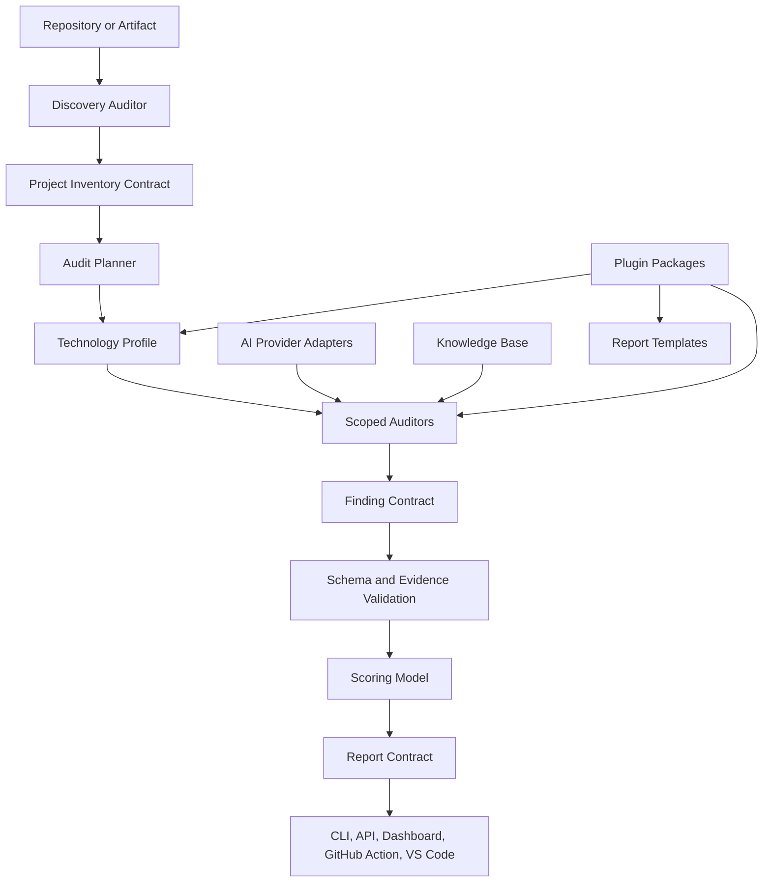
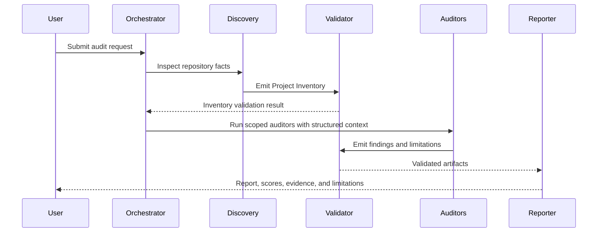

<a id="readme-top"></a>

<div align="center">

# AI Audit Framework

**A standardized framework for AI-powered software auditing.**

[](docs/ROADMAP.md)
[](docs/ARCHITECTURE.md)
[](schemas/)
[](LICENSE)
[](SECURITY.md)
[](governance/RFC_PROCESS.md)

</div>

<!-- Banner placeholder: replace this block with an image such as assets/brand/aaf-banner.svg when brand assets are added. -->
<table>
  <tr>
    <td width="100%">
      <strong>AI Audit Framework</strong><br />
      Modular auditors, validated contracts, evidence-backed findings, provider-independent model execution, and professional engineering reports.
    </td>
  </tr>
</table>

## Contents

- [Overview](#overview)
- [Why AAF Exists](#why-aaf-exists)
- [Core Philosophy](#core-philosophy)
- [Key Features](#key-features)
- [Current Maturity](#current-maturity)
- [Architecture Overview](#architecture-overview)
- [Audit Workflow](#audit-workflow)
- [Supported Auditors](#supported-auditors)
- [Knowledge Base](#knowledge-base)
- [Prompt Pipeline](#prompt-pipeline)
- [AI Compatibility](#ai-compatibility)
- [Project Structure](#project-structure)
- [Quick Start](#quick-start)
- [Installation](#installation)
- [Documentation](#documentation)
- [Community](#community)
- [Roadmap](#roadmap)
- [FAQ](#faq)
- [Contributing](#contributing)
- [License](#license)

## Overview

The AI Audit Framework (AAF) is an open-source framework for standardizing software audits performed with artificial intelligence.

AAF does not ask one large prompt to inspect an entire codebase and produce a report in a single step. It divides audit work into specialized auditors, validates the handoff between those auditors, records evidence for every meaningful claim, and assembles findings into a professional engineering report.

The framework is designed around a simple rule:

> [!IMPORTANT]
> An AI-generated audit result is not a finding until it is evidence-backed, scoped, classified, and valid against the framework contract.

AAF currently provides a documentation-first foundation: architecture, methodology, schemas, contracts, templates, governance, scoring rules, model-support requirements, and the first complete auditor specification: the [Discovery Auditor](auditors/discovery/README.md). Executable CLI, API, dashboard, plugin runtime, benchmark automation, and editor integrations are planned in the public [roadmap](docs/ROADMAP.md).

## Why AAF Exists

AI models can read code quickly, explain patterns clearly, and surface useful risks. They can also overgeneralize, miss context, confuse frameworks, invent unavailable runtime behavior, and produce confident recommendations without enough evidence.

AAF exists to make AI-assisted auditing behave more like an engineering process:

| Problem in unstructured AI audits | AAF response |
| --- | --- |
| A single prompt mixes discovery, analysis, severity, and reporting | Separate auditor modules with explicit scope |
| Findings appear without file, configuration, or runtime evidence | Evidence is required by schemas and core rules |
| Model-specific behavior leaks into reports | Provider adapters are separated from framework contracts |
| Different audits use different severity language | Shared severity, confidence, scoring, and report models |
| Context is lost between audit stages | Auditors exchange structured contracts |
| Reports are hard to compare across projects | Scores, categories, inventories, and findings use stable shapes |
| Future tooling must reinterpret prose | JSON Schema, YAML contracts, and specifications are first-class artifacts |

AAF is therefore a framework for repeatability, not a prompt collection.

## Core Philosophy

AAF is built on six operating principles.

| Principle | Meaning |
| --- | --- |
| Modular architecture | Each auditor owns one engineering domain and one bounded responsibility. |
| Explainability | Reports must show how conclusions were reached, which evidence was used, and which limitations remain. |
| Evidence-based findings | Unsupported observations are rejected or recorded as limitations. They are not softened into vague recommendations. |
| Reproducibility | Audit stages, model metadata, schemas, contracts, and report outputs must be traceable. |
| Standardization | Severity, confidence, scoring, terminology, templates, and handoffs use shared definitions. |
| Model independence | OpenAI, Anthropic, Google, xAI, DeepSeek, Qwen, local LLMs, and future providers should integrate through adapters instead of changing auditor contracts. |

> [!NOTE]
> The current repository defines the framework foundation. It intentionally separates implemented documentation and contracts from future executable surfaces so adopters can see what is stable today and what is planned.

## Key Features

| Area | What exists now | Related files |
| --- | --- | --- |
| Methodology | Staged audit lifecycle with quality gates | [docs/METHODOLOGY.md](docs/METHODOLOGY.md), [core/workflow.md](core/workflow.md) |
| Architecture | Modular component model and provider boundary | [docs/ARCHITECTURE.md](docs/ARCHITECTURE.md), [adr/0002-module-architecture.md](adr/0002-module-architecture.md) |
| Discovery Auditor | Complete first auditor specification, checklist, prompt, and tests directory | [auditors/discovery/README.md](auditors/discovery/README.md) |
| Contracts | YAML handoff contracts for inventory, findings, and reports | [contracts/](contracts/) |
| Schemas | JSON Schema validation for audit, inventory, finding, and report artifacts | [schemas/](schemas/) |
| Scoring | 0-100 scoring model with category weights and severity impact guidance | [core/scoring.md](core/scoring.md) |
| Templates | Standard report, finding, recommendation, risk matrix, inventory, and executive-summary templates | [templates/](templates/) |
| Knowledge Base | Vendor-neutral engineering knowledge structure for auditors | [knowledge/README.md](knowledge/README.md) |
| Model support | Adapter metadata and provider-independent model participation rules | [docs/MODEL_SUPPORT.md](docs/MODEL_SUPPORT.md), [models/README.md](models/README.md) |
| Governance | RFC, decision, release, contribution, security, and change policies | [governance/](governance/), [SECURITY.md](SECURITY.md) |

<details>
<summary><strong>What AAF is not</strong></summary>

AAF is not a vulnerability scanner, not a static analyzer, not a hosted SaaS product, not a model provider, and not a replacement for human engineering review.

It is a specification-led framework for organizing AI-assisted audits so findings become traceable, comparable, and reviewable.

</details>

## Current Maturity

AAF uses a documentation-first release model. The repository currently establishes the framework foundation rather than a packaged runtime.

| Capability | Status | Notes |
| --- | --- | --- |
| Core methodology | Available | Defines the lifecycle and quality gates. |
| Core architecture | Available | Defines component boundaries and future delivery surfaces. |
| Discovery Auditor | Available | First complete auditor module. |
| Finding, inventory, report schemas | Available | JSON Schema draft 2020-12. |
| Contracts and templates | Available | YAML and Markdown artifacts for standard handoffs. |
| CLI | Planned | Reserved command model in [cli/README.md](cli/README.md). |
| REST API | Planned | Reserved endpoint responsibilities in [api/README.md](api/README.md). |
| Dashboard | Planned | Reserved product architecture in [dashboard/README.md](dashboard/README.md). |
| Plugin SDK | Planned | Template and ADR exist; runtime loading is future work. |
| Model certification | Planned | Record model defined; benchmarked certification is future work. |

> [!WARNING]
> Commands such as `aaf audit`, `aaf profile`, `aaf benchmark`, and `aaf report` are part of the planned executable core. They are documented as target behavior, not as installed commands in this foundation release.

## Architecture Overview

AAF separates source inspection, auditor reasoning, validation, scoring, and report rendering into explicit framework components.



The architecture has four important boundaries:

| Boundary | Responsibility |
| --- | --- |
| Auditor boundary | Auditors consume structured inputs and emit structured outputs for one domain. |
| Contract boundary | Inventory, findings, and reports move between components through machine-readable contracts. |
| Provider boundary | AI models are accessed through adapters; provider behavior must not change AAF schemas. |
| Surface boundary | CLI, API, dashboard, GitHub Action, and VS Code surfaces call orchestration behavior instead of embedding auditor logic. |

The source Mermaid files live in [assets/diagrams/](assets/diagrams/).

## Audit Workflow

Every AAF audit follows a staged lifecycle. Later auditors are not expected to guess project context; they consume the Project Inventory created by Discovery.



The canonical workflow is:

1. Collect audit request metadata.
2. Run the Discovery Auditor.
3. Validate the Project Inventory.
4. Select profiles and scoped auditors.
5. Run scoped auditors.
6. Validate findings and limitations.
7. Calculate scores.
8. Render reports.
9. Store evidence and execution metadata.

Quality gates are defined in [docs/METHODOLOGY.md](docs/METHODOLOGY.md) and [core/rules.md](core/rules.md).

## Supported Auditors

AAF defines auditor domains as independent modules. In the current repository, Discovery is the first complete auditor; the other domains are part of the standard audit architecture and roadmap.

| Auditor | Current repository status | Responsibility |
| --- | --- | --- |
| Discovery | Complete specification | Detects project facts, technologies, delivery surfaces, configuration signals, documentation, and limitations. Produces the Project Inventory. |
| Architecture | Planned auditor domain | Reviews system structure, boundaries, dependencies, coupling, scalability assumptions, and architectural risks. |
| Security | Planned auditor domain | Reviews authentication, authorization, data exposure, insecure configuration, dependency risk, secrets handling, and applicable standards. |
| Code Quality | Planned auditor domain | Reviews maintainability, complexity, duplication, testability, readability, and implementation consistency. |
| Performance | Planned auditor domain | Reviews latency risks, database access patterns, caching, payload size, concurrency, and resource usage. |
| Infrastructure | Planned auditor domain | Reviews deployment, CI/CD, containers, cloud configuration, observability, backup posture, and production readiness. |
| Report | Planned report builder domain | Consolidates validated inventories, findings, scores, methodology, limitations, and appendices into audience-ready reports. |

<details>
<summary><strong>Discovery Auditor output contract</strong></summary>

The Discovery Auditor emits a Project Inventory in Markdown, JSON, or YAML. The JSON form validates against [schemas/inventory.schema.json](schemas/inventory.schema.json), and the YAML form conforms to [contracts/inventory.yml](contracts/inventory.yml).

Required inventory sections include:

- `metadata`
- `project`
- `technologies`
- `surfaces`
- `delivery`
- `configuration`
- `documentation`
- `limitations`

Discovery records facts and confidence. It does not produce security findings, architecture recommendations, performance conclusions, or code-quality scores.

</details>

## Knowledge Base

The [Knowledge Base](knowledge/README.md) organizes reusable engineering knowledge that auditors can use consistently across projects.

Current knowledge categories are:

| Section | Example topics |
| --- | --- |
| Security | Authentication, authorization, JWT, OAuth, OWASP categories, common weakness patterns |
| Languages | Runtime behavior, package managers, idioms, test conventions |
| Frameworks | Routing, middleware, rendering, dependency injection, build output, deployment expectations |
| Databases | PostgreSQL, MySQL, Redis, MongoDB, migrations, query patterns, connection handling |
| Cloud | Deployment targets, IAM, storage, networking, managed services, configuration evidence |
| Architecture | Boundaries, coupling, modularity, resilience, observability, data flow |

Auditors consume the Knowledge Base as context, not as authority that overrides evidence. If repository evidence conflicts with a general knowledge entry, the auditor must record the repository evidence and explain any uncertainty.

## Prompt Pipeline

AAF's prompt system is specified as an orchestration layer rather than a single prompt. The prompt pipeline is responsible for moving structured context through specialized roles.

| Prompt role | Responsibility |
| --- | --- |
| System | Defines invariant rules, terminology, output requirements, and safety constraints. |
| Planner | Selects workflow stages, profiles, auditors, and required inputs. |
| Discovery | Produces the Project Inventory from repository evidence. |
| Security | Produces scoped security findings when implemented and activated. |
| Reviewer | Checks output against contracts, evidence requirements, and auditor scope. |
| Critic | Challenges weak severity, missing evidence, unsupported recommendations, and ambiguity. |
| Reporter | Converts validated artifacts into executive and engineering report sections. |

Prompt chaining follows contract boundaries:

```text
System rules
    |
    v
Planner prompt
    |
    v
Discovery prompt --> Project Inventory --> Validation
                                      |
                                      v
Scoped auditor prompts --> Findings --> Review/Critic --> Report prompt
```

The prompt specification lives in [specifications/prompt-specification.md](specifications/prompt-specification.md), and the Discovery prompt lives in [auditors/discovery/prompt.md](auditors/discovery/prompt.md).

## AI Compatibility

AAF is model independent by design. Models participate through provider adapters that expose capabilities and constraints without changing framework artifacts.

Adapter metadata should record:

| Metadata | Purpose |
| --- | --- |
| Provider and model name | Identifies the AI system used for the run. |
| Model version | Preserves reproducibility when providers update models. |
| Adapter version | Records framework integration behavior. |
| Context limits | Explains what source material could be reviewed. |
| Tool permissions | Shows whether repository inspection, shell access, or file reads were available. |
| Structured output support | Documents JSON mode, schema mode, tool calls, or validation-retry behavior. |
| Validation retries | Records attempts required to produce valid artifacts. |
| Known limitations | Prevents reports from hiding model or runtime constraints. |

The model-support policy is documented in [docs/MODEL_SUPPORT.md](docs/MODEL_SUPPORT.md). Certification records are reserved in [models/README.md](models/README.md) for future benchmarked model assessments.

## Project Structure

```text
AI-Audit-Framework/
|-- .github/                 Repository automation and community metadata
|-- .vscode/                 Editor workspace configuration
|-- adr/                     Architecture decision records
|-- api/                     Planned REST API architecture
|-- assets/                  Diagram assets and future brand assets
|-- auditors/                Auditor modules and specifications
|   `-- discovery/           First complete auditor
|-- benchmarks/              Planned benchmark methodology and datasets
|-- cli/                     Planned command-line interface architecture
|-- contracts/               YAML contracts exchanged between framework components
|-- core/                    Core rules, workflow, scoring, terminology, persona, and output rules
|-- dashboard/               Planned dashboard architecture
|-- docs/                    Framework documentation
|-- examples/                Example space for audit inputs and outputs
|-- fixtures/                Fixture space for tests and reproducible scenarios
|-- governance/              RFC, release, and decision processes
|-- knowledge/               Shared engineering knowledge base
|-- models/                  Model certification record format
|-- profiles/                Technology profile definitions and future activation rules
|-- resources/               Supporting resources
|-- schemas/                 JSON Schema contracts
|-- sdk/                     Plugin SDK templates and future extension points
|-- specifications/          RFC-style framework specifications
|-- templates/               Report, finding, recommendation, inventory, and risk templates
`-- tests/                   Test strategy and future validation tests
```

## Quick Start

Use this foundation release to understand the framework, author auditor outputs, and validate artifacts against the published contracts.

### 1. Clone the repository

```bash
git clone https://github.com/<organization>/AI-Audit-Framework.git
cd AI-Audit-Framework
```

Replace `<organization>` with the repository owner used by your fork or upstream remote.

### 2. Read the audit lifecycle

Start with:

- [docs/METHODOLOGY.md](docs/METHODOLOGY.md)
- [docs/ARCHITECTURE.md](docs/ARCHITECTURE.md)
- [core/workflow.md](core/workflow.md)
- [core/rules.md](core/rules.md)

These documents define how AAF turns source evidence into validated outputs.

### 3. Run a manual Discovery pass

Use the Discovery materials as the first practical workflow:

- [auditors/discovery/checklist.md](auditors/discovery/checklist.md)
- [auditors/discovery/prompt.md](auditors/discovery/prompt.md)
- [auditors/discovery/specification.md](auditors/discovery/specification.md)

The expected result is a Project Inventory that lists detected technologies, delivery surfaces, configuration signals, documentation, and limitations with evidence.

### 4. Validate artifact shape

Use the schemas in [schemas/](schemas/) with any JSON Schema draft 2020-12 validator.

Example with `ajv-cli`:

```bash
npx ajv-cli validate \
  --spec=draft2020 \
  -s schemas/inventory.schema.json \
  -d path/to/inventory.json
```

Example with Python:

```bash
python -m pip install jsonschema
python - <<'PY'
import json
from pathlib import Path
from jsonschema import Draft202012Validator

schema = json.loads(Path("schemas/inventory.schema.json").read_text())
data = json.loads(Path("path/to/inventory.json").read_text())
Draft202012Validator(schema).validate(data)
print("inventory is valid")
PY
```

### 5. Assemble a report

Use:

- [templates/report-template.md](templates/report-template.md)
- [templates/finding-template.md](templates/finding-template.md)
- [templates/risk-matrix-template.md](templates/risk-matrix-template.md)
- [specifications/report-specification.md](specifications/report-specification.md)

Reports must separate facts, findings, recommendations, scores, methodology, and limitations.

## Installation

AAF v0.1 does not install a runtime package. Install the framework documentation and contracts by cloning the repository.

```bash
git clone https://github.com/<organization>/AI-Audit-Framework.git
cd AI-Audit-Framework
```

Optional local documentation checks depend on your toolchain. The repository includes Markdown, spelling, schema, and governance-oriented assets, but it does not currently define a package manager lockfile or executable `aaf` binary.

For planned installable surfaces, see:

- [cli/README.md](cli/README.md)
- [api/README.md](api/README.md)
- [dashboard/README.md](dashboard/README.md)
- [docs/EXECUTION.md](docs/EXECUTION.md)

## Documentation

The documentation is organized by reader goal.

| Goal | Start here |
| --- | --- |
| Understand the framework | [docs/METHODOLOGY.md](docs/METHODOLOGY.md), [docs/DESIGN.md](docs/DESIGN.md), [docs/ARCHITECTURE.md](docs/ARCHITECTURE.md) |
| Learn canonical terms | [docs/TERMINOLOGY.md](docs/TERMINOLOGY.md), [core/glossary.md](core/glossary.md) |
| Understand the execution model | [docs/EXECUTION.md](docs/EXECUTION.md), [core/workflow.md](core/workflow.md) |
| Review security assumptions | [docs/SECURITY_MODEL.md](docs/SECURITY_MODEL.md), [SECURITY.md](SECURITY.md) |
| Use the Discovery Auditor | [auditors/discovery/README.md](auditors/discovery/README.md), [auditors/discovery/checklist.md](auditors/discovery/checklist.md), [auditors/discovery/prompt.md](auditors/discovery/prompt.md) |
| Validate artifacts | [schemas/](schemas/), [contracts/](contracts/), [specifications/](specifications/) |
| Build reports | [templates/](templates/), [specifications/report-specification.md](specifications/report-specification.md) |
| Understand model support | [docs/MODEL_SUPPORT.md](docs/MODEL_SUPPORT.md), [models/README.md](models/README.md) |
| Contribute changes | [CONTRIBUTING.md](CONTRIBUTING.md), [docs/CONTRIBUTING_GUIDE.md](docs/CONTRIBUTING_GUIDE.md), [governance/RFC_PROCESS.md](governance/RFC_PROCESS.md) |
| Track planned work | [docs/ROADMAP.md](docs/ROADMAP.md), [CHANGELOG.md](CHANGELOG.md) |

<details>
<summary><strong>Core specifications</strong></summary>

- [specifications/module-specification.md](specifications/module-specification.md)
- [specifications/inventory-specification.md](specifications/inventory-specification.md)
- [specifications/finding-specification.md](specifications/finding-specification.md)
- [specifications/report-specification.md](specifications/report-specification.md)
- [specifications/prompt-specification.md](specifications/prompt-specification.md)
- [specifications/checklist-specification.md](specifications/checklist-specification.md)

</details>

## Community

AAF is structured as an open-source engineering project. Community participation should improve the framework as a shared standard, not add isolated prompts that cannot be validated or maintained.

| Resource | Purpose |
| --- | --- |
| [CODE_OF_CONDUCT.md](CODE_OF_CONDUCT.md) | Community behavior expectations. |
| [CONTRIBUTING.md](CONTRIBUTING.md) | Contribution entry point. |
| [docs/CONTRIBUTING_GUIDE.md](docs/CONTRIBUTING_GUIDE.md) | Detailed contribution process. |
| [governance/RFC_PROCESS.md](governance/RFC_PROCESS.md) | Proposal process for framework changes. |
| [governance/DECISION_PROCESS.md](governance/DECISION_PROCESS.md) | Decision-making rules. |
| [governance/RELEASE_PROCESS.md](governance/RELEASE_PROCESS.md) | Release process. |
| [SECURITY.md](SECURITY.md) | Security reporting and handling. |

## Roadmap

The public roadmap turns the current documentation-first foundation into executable, validated, and benchmarked audit infrastructure.

| Milestone | Theme | Intended outcomes |
| --- | --- | --- |
| v0.1 Foundation | Specifications and contracts | Repository structure, methodology, governance, schemas, contracts, templates, Discovery Auditor, scoring, severity, evidence, inventory, report, and finding models. |
| v0.2 Executable Core | First command surfaces | CLI surfaces for discovery and report validation, schema validation commands, fixture-based Discovery tests, initial technology profiles. |
| v0.3 Auditor Expansion | Additional auditor specs | Security, Architecture, Code Quality, and Performance auditor specifications, model adapter interfaces, reproducible audit bundles, benchmark datasets. |
| v0.5 Platform Integrations | Delivery surfaces | GitHub Action, VS Code extension prototype, REST API prototype, dashboard prototype, plugin SDK loading, multi-model validation workflows. |
| v1.0 Stable Framework | Compatibility guarantees | Stable public schemas, contracts, CLI commands, plugin SDK, benchmark methodology, certification process, release signing, migration guides, and reference documentation. |

Read the full plan in [docs/ROADMAP.md](docs/ROADMAP.md).

## FAQ

### Is AAF ready to run automated audits?

Not yet. The current release is a foundation release. It defines the framework, contracts, schemas, templates, governance, and Discovery Auditor materials. Executable audit orchestration is planned for later milestones.

### Is AAF just a collection of prompts?

No. Prompts are one part of the framework. AAF also defines auditor scope, structured contracts, validation schemas, scoring, report templates, terminology, governance, model metadata, and future execution surfaces.

### Can I use AAF manually today?

Yes. You can use the Discovery checklist and prompt to produce a Project Inventory, validate the output shape against the inventory schema, and use report templates to assemble a reviewable audit artifact.

### Which AI model should I use?

AAF does not require one model. Use a model that can inspect the required evidence, follow structured output constraints, state limitations, and support your privacy requirements. Record model and adapter metadata as described in [docs/MODEL_SUPPORT.md](docs/MODEL_SUPPORT.md).

### Are generated findings automatically trusted?

No. Findings must include evidence, severity, confidence, impact, recommendation, references, and validation status. Observations without evidence must be rejected or recorded as limitations.

### Does Discovery produce security findings?

No. Discovery produces the Project Inventory. It may record evidence that later security auditors need, but it does not classify vulnerabilities or recommend fixes.

### How are scores calculated?

AAF uses weighted category scores on a 0-100 scale. The default weights are documented in [core/scoring.md](core/scoring.md). Reports must include calculation details.

### Where should new auditor work begin?

Start with [specifications/module-specification.md](specifications/module-specification.md), [core/rules.md](core/rules.md), and the Discovery Auditor as a reference module.

For additional answers, see [docs/FAQ.md](docs/FAQ.md).

## Contributing

Contributions are welcome when they preserve the framework's contract-driven design.

Good contributions usually do one of the following:

- Improve a specification, schema, contract, template, or governance document.
- Add evidence requirements or validation clarity.
- Extend Discovery with documented behavior and fixture coverage.
- Add a profile with activation evidence and scoped checks.
- Propose an auditor through the RFC process.
- Improve examples, fixtures, benchmarks, or model-support records.

Before opening a substantial change:

1. Read [CONTRIBUTING.md](CONTRIBUTING.md).
2. Check [docs/CHANGE_POLICY.md](docs/CHANGE_POLICY.md).
3. Use [governance/RFC_PROCESS.md](governance/RFC_PROCESS.md) for changes that affect contracts, schemas, auditor behavior, or public compatibility.
4. Update related docs, schemas, templates, and examples together.

> [!TIP]
> AAF maintainers review for evidence quality, naming consistency, provider independence, schema compatibility, and long-term maintainability. Small prompt-only changes are usually not enough unless they also preserve the contracts around the prompt.

## License

AAF is released under the [MIT License](LICENSE).

<p align="right"><a href="#readme-top">Back to top</a></p>
